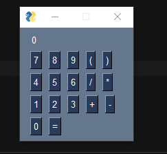

# Basic Calculator

This program is just a basic (as in simple) calculator for demonstration purposes to AS/A Level computer science students.



## Install
- To install the required packages, type this in your console:
```sh
pip install -r requirements.txt
```

## CS Theory used:
- [The Shunting Yard Algorithm](http://en.wikipedia.org/wiki/Shunting-yard_algorithm)
- [Stack](http://en.wikipedia.org/wiki/Stack_(abstract_data_type))
- [Infix notation](http://en.wikipedia.org/wiki/Infix_notation)
- [Reverse Polish Notation (postfix notation)](http://en.wikipedia.org/wiki/Reverse_Polish_notation)
- [Operator Precedence](http://en.wikipedia.org/wiki/Order_of_operations)